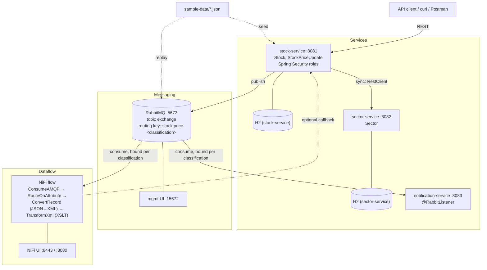
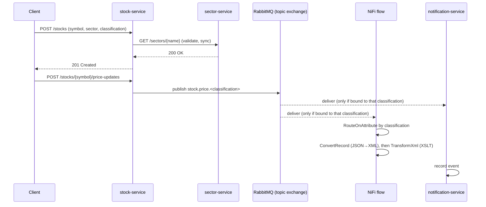

# projectNifi — Roadmap

This is a living planning document. Edit it directly at any time — add, remove,
reorder, or tick off items — and future work (by you or by Claude) should pick up
your edits automatically by reading this file before starting.

## Overview

A learning project for building Spring Boot / Java backend skills, built
incrementally — one checklist item at a time, not all at once.

## Domain & Purpose

**Stocks & Shares Tracker** — a small set of fictional companies (`Stock`s),
grouped by `Sector`, each emitting simulated `StockPriceUpdate` events that flow
through RabbitMQ into NiFi. Chosen over an earlier generic Task Tracker idea
because a price-update stream is a much better fit for message-driven/dataflow
learning — a continuous stream of ticks gives NiFi something genuinely useful to
process, and gives the access-control milestone below a natural reason to exist
(not everyone should see every price). Data is entirely fictional — no real
companies, symbols, or market data. Swap-friendly as always — edit this section
to change domain again.

Fictional seed data lives in `sample-data/` (`stocks.json`,
`price-updates.json`) — see `sample-data/README.md`.

For a plain-English walkthrough of what the finished system actually does
(no diagrams, no jargon), see [`how-it-works.md`](how-it-works.md).

## Architecture

Three small services, chosen to demonstrate both synchronous and asynchronous
inter-service communication — nothing more (no service discovery, config server,
or API gateway; deliberately kept minimal, see Stretch/later).

### Request flow (example)

- **`stock-service`** — owns `Stock` (reference data) and publishes
  `StockPriceUpdate` events to RabbitMQ. User-facing/primary service.
- **`sector-service`** — owns `Sector` reference data (Technology, Energy,
  Healthcare, ...). `stock-service` calls it **synchronously** (Spring's
  built-in `RestClient`) to validate a stock's sector — demonstrates direct
  REST-to-REST service communication.
- **`notification-service`** — consumes price-update events from RabbitMQ
  **asynchronously** (`@RabbitListener`), separately from NiFi's consumption of
  the same stream. Just logs/records what it receives.
- **NiFi flow** — after routing by classification, converts the JSON price
  update to XML (`ConvertRecord`) and reshapes it with an XSLT stylesheet
  (`TransformXml`) into a `<priceReport>` — element-to-attribute, string
  concatenation, and conditional branching, the classic XSLT moves. Stylesheet
  lives in `nifi/xslt/price-report.xsl`; a verified example input/output pair
  is in `sample-data/price-update.xml` / `price-report-example.xml`.

Multi-module Maven build: root `pom.xml` becomes a parent aggregator
(`packaging=pom`, shared dependency management), with `stock-service/`,
`sector-service/`, `notification-service/` as sibling modules, each its own
runnable Spring Boot app.

## Data Classification & Access Control

Each `Stock` (and the `StockPriceUpdate` events it emits) carries a
`classification` label: `PUBLIC`, `INTERNAL`, or `RESTRICTED`. Two complementary
layers enforce it:

- **Application layer** (`stock-service`) — Spring Security with a few in-memory
  roles (`ROLE_VIEWER` → PUBLIC only, `ROLE_ANALYST` → PUBLIC + INTERNAL,
  `ROLE_ADMIN` → everything). The service layer filters query results by the
  caller's role vs. each record's classification — the easiest place to see it
  working.
- **Infrastructure layer** (RabbitMQ + NiFi) — price updates publish to a
  **topic exchange** with routing key `stock.price.<classification>`. Consumers
  only bind queues to the routing keys they're allowed to see, so
  `notification-service` and the NiFi flow can each be configured to only
  receive certain classifications — access control enforced by the messaging
  topology itself, not just application code. In NiFi, the classification also
  arrives as a FlowFile attribute (from the AMQP header), so `RouteOnAttribute`
  can branch the flow per label, visibly on the canvas.

No full identity provider/OAuth2 needed for this — in-memory users are enough to
demonstrate the pattern. Real auth (OAuth2/JWT via an IdP) is listed as a
stretch item if wanted later.

## Interface

REST APIs, to start — simplest way to focus on core Spring concepts first.
A UI is listed as a later stretch item below, not a blocker.

Two additional UIs come along with the messaging milestone, run as local
infrastructure (not built by us) rather than part of the Spring apps:
- **RabbitMQ management UI** — inspect queues/messages in the browser.
- **Apache NiFi UI** — build/watch the dataflow on NiFi's flow canvas.

See `docs/local-dev.md` (once created — see the Local Developer Experience
milestone) for the exact local URLs/ports for everything above.

## Working method

- Work through the checklist **one item at a time**. Finish and verify one before
  starting the next.
- Tick items off as `- [x]` when done; a short note (date, brief detail) is
  optional but helpful.
- This doc is editable — reorder, add, cut, or split items whenever priorities
  change.
- An item isn't done just because it works — it also has to clear the
  **Definition of Done** below before being ticked off.

## Definition of Done

A standing bar every checklist item is measured against — not one-off tasks,
apply continuously as each service/feature lands:

- **Test coverage** — ≥90% JUnit line coverage per module, enforced by the
  JaCoCo Maven plugin (build fails below threshold, bound to `verify`). Unit
  tests for services (Mockito), integration tests (`MockMvc`) for controllers.
- **Security practices** — no secrets committed (env vars only — the repo
  already `.gitignore`s common secret/credential patterns); centralized
  exception handling never leaks stack traces/internal detail in API
  responses; Actuator endpoints locked down beyond health/info; dependencies
  scanned for known vulnerabilities (OWASP Dependency-Check); passwords, once
  persisted, hashed with `BCryptPasswordEncoder`; classification/RBAC checks
  (see Data Classification & Access Control) always enforced server-side,
  never trusted from the client.
- **Documentation** — every public class and method gets a doc comment
  (Javadoc) explaining what it does and *why*, not just restating the
  signature; non-trivial logic gets inline comments walking through the
  reasoning. This project is explicitly for learning, so comments favor being
  thorough over minimal — the usual "avoid over-commenting" default is
  deliberately relaxed here, project-wide.

## Roadmap checklist

### Foundations
- [x] Restructure repo into a multi-module Maven build: parent aggregator POM + `stock-service` module holding the existing skeleton code (update README run instructions for the new layout as a follow-up)
- [ ] Package structure within `stock-service` (`controller`, `service`, `repository`, `model`, `dto`, `exception`, `config`)
- [ ] `Stock` entity + Spring Data JPA repository in `stock-service`
- [ ] Basic CRUD REST endpoints for `Stock` (entity returned directly, no DTOs yet) — verify via curl/Postman + H2 console
- [ ] Seed `stock-service` with `sample-data/stocks.json` on startup (e.g. `CommandLineRunner` or `data.sql`)

### Cross-cutting: Testing & Security Setup
- [ ] Add JaCoCo Maven plugin to the parent POM: coverage report + a ≥90% line-coverage check bound to `verify`
- [ ] Add OWASP Dependency-Check Maven plugin to the parent POM for dependency vulnerability scanning
- [ ] Confirm `.gitignore`'s existing secret/credential patterns extend cleanly to each module's `application*.properties`

### Solidify the basics
- [ ] Request/response DTOs + mapping; refactor controller to use them
- [ ] Input validation (`spring-boot-starter-validation`)
- [ ] Centralized exception handling (`@ControllerAdvice`, custom exceptions) — verify error responses never leak stack traces
- [ ] Unit tests for the service layer (Mockito) + integration tests for the controller (`MockMvc`) — meet the ≥90% coverage bar from the Definition of Done

### Grow the domain
- [ ] Pagination & sorting on the `Stock` list endpoint

### Microservices: Sector Service
- [ ] Scaffold `sector-service` module (own Spring Boot app, port :8082, own H2 instance)
- [ ] `Sector` entity + repository + basic CRUD REST endpoints in `sector-service`
- [ ] `stock-service` calls `sector-service` synchronously (Spring `RestClient`) when a Stock references a sector — validate it exists
- [ ] Verify end-to-end: create a Sector via `sector-service`, then create a Stock in `stock-service` referencing it, confirm the cross-service call works

### Messaging & Dataflow (RabbitMQ + NiFi)
- [ ] `docker-compose.yml` running RabbitMQ (`rabbitmq:management`, UI on :15672) and Apache NiFi (`apache/nifi`, UI on :8443 or :8080) locally
- [ ] Add `spring-boot-starter-amqp`; connect `stock-service` to local RabbitMQ (simple queue/exchange to start — topic routing comes in the Data Classification milestone below)
- [ ] Publish a `StockPriceUpdate` message to RabbitMQ when a price changes — replay `sample-data/price-updates.json` (small script or test) to generate a stream — verify messages arrive in the RabbitMQ management UI
- [ ] Build a NiFi flow (`ConsumeAMQP` processor) that consumes the queue and does something visible with it (e.g. log to file) — verify on the NiFi canvas
- [ ] Extend the flow: `ConvertRecord` (JSON reader → XML writer) then `TransformXml` using `nifi/xslt/price-report.xsl` to produce a `<priceReport>` — verify the output matches `sample-data/price-report-example.xml`
- [ ] (Optional) Extend the NiFi flow to call back into `stock-service`'s REST API, closing the loop

### Microservices: Notification Service
- [ ] Scaffold `notification-service` module (own Spring Boot app, port :8083)
- [ ] `@RabbitListener` consumer for `StockPriceUpdate` events (separate binding from NiFi's, so both receive a copy)
- [ ] Record received events (in-memory list or simple H2 table) — verify by publishing price updates and checking `notification-service`'s log/endpoint

### Data Classification & Access Control
- [ ] Add `classification` field (`PUBLIC` / `INTERNAL` / `RESTRICTED`) to `Stock`, propagate to `StockPriceUpdate` events
- [ ] Add `spring-boot-starter-security` to `stock-service` with a few in-memory users/roles (`ROLE_VIEWER`, `ROLE_ANALYST`, `ROLE_ADMIN`)
- [ ] Filter `stock-service` query results by caller's role vs. each record's classification — verify by hitting the API as different users
- [ ] Switch the RabbitMQ exchange to a topic exchange; publish with routing key `stock.price.<classification>`
- [ ] Bind `notification-service` (and the NiFi flow) to only the routing keys/classifications they're meant to see — verify a RESTRICTED update never reaches a consumer only bound to `stock.price.public`
- [ ] (Optional) Use the classification FlowFile attribute in NiFi with `RouteOnAttribute` to branch the flow per label

### Local Developer Experience (VSCode)
- [ ] `.vscode/tasks.json`: tasks to start/stop local infra (`docker compose up -d` / `docker compose down`) for RabbitMQ + NiFi
- [ ] `.vscode/launch.json`: a Java launch config per service (`stock-service`, `sector-service`, `notification-service`) plus a compound config to launch all three together
- [ ] `.vscode/extensions.json`: recommend the Spring Boot Dashboard extension for one-click start/stop/debug across the multi-module workspace
- [ ] `docs/local-dev.md`: one-page "start everything" guide — exact steps plus a single table of every local URL/port (RabbitMQ mgmt UI, NiFi UI, each service's REST base URL, each H2 console)
- [ ] End-to-end check: from a clean checkout, follow `docs/local-dev.md` and confirm every UI is reachable and a price update flows all the way through (stock-service → RabbitMQ → NiFi canvas / notification-service)

### Stretch / later
- [ ] Actuator (health/info endpoints)
- [ ] API docs (springdoc-openapi)
- [ ] Real auth (OAuth2/JWT via an identity provider) in place of in-memory users
- [ ] Swap H2 for a real database (e.g. Postgres via Docker Compose)
- [ ] Optional UI (Thymeleaf or separate frontend)
- [ ] Service discovery / config server / API gateway (Eureka, Spring Cloud Config, Spring Cloud Gateway) — deliberately out of scope for now; the point of this project is demonstrating sync + async communication between a small number of services, not full microservices infra. Revisit only if that changes.
- [ ] Static analysis: SpotBugs + find-sec-bugs
- [ ] OWASP ZAP baseline scan against the running services

## Current State

- Java 21, Spring Boot 3.5.0, Maven.
- Dependencies: `spring-boot-starter-web`, `spring-boot-starter-data-jpa`, `h2` (runtime),
  `spring-boot-starter-test`.
- Multi-module Maven build in place: root `pom.xml` is a `packaging=pom`
  parent aggregator (inherits `spring-boot-starter-parent`, declares
  `stock-service` as its only module so far); `stock-service/pom.xml` holds
  the Spring Boot dependencies and plugin. `./mvnw verify` builds the whole
  reactor.
- No controllers, entities, repositories, or services yet — the moved code is
  still just the skeleton `ProjectNifiApplication` + one context-loads test,
  now living under `stock-service/src/`.
- `application.properties` (in `stock-service/src/main/resources/`) only sets
  `spring.application.name`.
- README's run/test instructions still describe the old single-module layout
  (`./mvnw spring-boot:run` from the root) — updating them for the new
  `stock-service/` layout is a deliberate follow-up, not yet done.
- Fictional sample data available in `sample-data/` (`stocks.json`,
  `price-updates.json`) ready to seed/replay once `stock-service` exists.
- XSLT stylesheet at `nifi/xslt/price-report.xsl` written and verified against
  `sample-data/price-update.xml` (output matches `sample-data/price-report-example.xml`,
  confirmed via the JDK's built-in XSLT processor) — ready to wire into the NiFi
  flow once that milestone starts.

## How to update this plan

- Edit this file directly whenever priorities, scope, or decisions change.
- Claude should re-read this file at the start of a session, work on the next
  unticked checklist item (not several at once unless asked), and update
  **Current State** as items land.
- Tick items off `[x]` as they're completed; let git history hold the detail.
