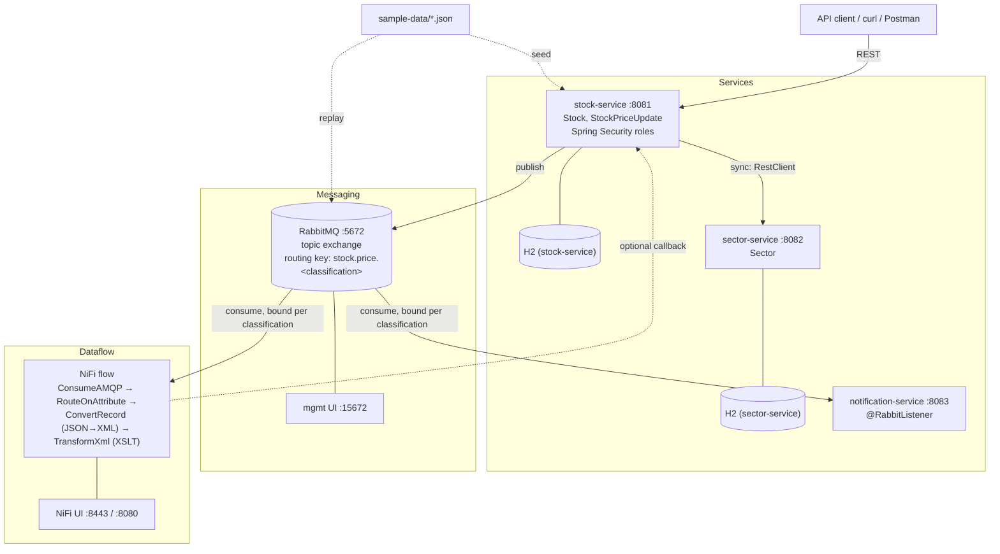
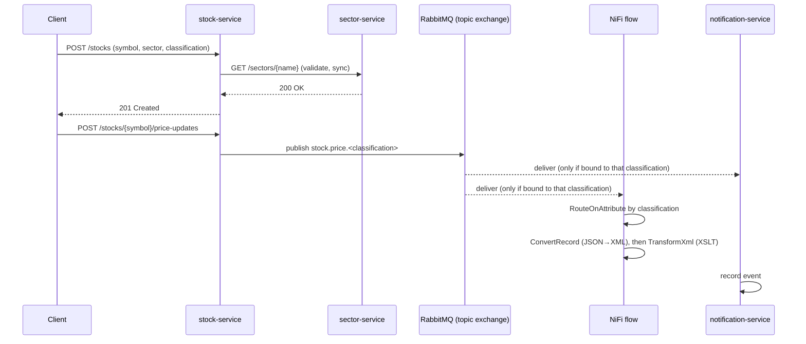

# projectNifi — Roadmap

This is a living planning document. Edit it directly at any time — add, remove,
reorder, or tick off items — and future work (by you or by Claude) should pick up
your edits automatically by reading this file before starting.

## Overview

A learning project for building Spring Boot / Java backend skills, built
incrementally — one checklist item at a time, not all at once.

## Domain & Purpose

**Stocks & Shares Tracker** — a small set of fictional companies (`Stock`s),
grouped by `Sector`, each emitting simulated `StockPriceUpdate` events that flow
through RabbitMQ into NiFi. Chosen over an earlier generic Task Tracker idea
because a price-update stream is a much better fit for message-driven/dataflow
learning — a continuous stream of ticks gives NiFi something genuinely useful to
process, and gives the access-control milestone below a natural reason to exist
(not everyone should see every price). Data is entirely fictional — no real
companies, symbols, or market data. Swap-friendly as always — edit this section
to change domain again.

Fictional seed data lives in `sample-data/` (`stocks.json`,
`price-updates.json`) — see `sample-data/README.md`.

For a plain-English walkthrough of what the finished system actually does
(no diagrams, no jargon), see [`how-it-works.md`](how-it-works.md).

## Architecture

Three small services, chosen to demonstrate both synchronous and asynchronous
inter-service communication — nothing more (no service discovery, config server,
or API gateway; deliberately kept minimal, see Stretch/later).

### Request flow (example)

- **`stock-service`** — owns `Stock` (reference data) and publishes
  `StockPriceUpdate` events to RabbitMQ. User-facing/primary service.
- **`sector-service`** — owns `Sector` reference data (Technology, Energy,
  Healthcare, ...). `stock-service` calls it **synchronously** (Spring's
  built-in `RestClient`) to validate a stock's sector — demonstrates direct
  REST-to-REST service communication.
- **`notification-service`** — consumes price-update events from RabbitMQ
  **asynchronously** (`@RabbitListener`), separately from NiFi's consumption of
  the same stream. Just logs/records what it receives.
- **NiFi flow** — after routing by classification, converts the JSON price
  update to XML (`ConvertRecord`) and reshapes it with an XSLT stylesheet
  (`TransformXml`) into a `<priceReport>` — element-to-attribute, string
  concatenation, and conditional branching, the classic XSLT moves. Stylesheet
  lives in `nifi/xslt/price-report.xsl`; a verified example input/output pair
  is in `sample-data/price-update.xml` / `price-report-example.xml`.

Multi-module Maven build: root `pom.xml` becomes a parent aggregator
(`packaging=pom`, shared dependency management), with `stock-service/`,
`sector-service/`, `notification-service/` as sibling modules, each its own
runnable Spring Boot app.

## Data Classification & Access Control

Each `Stock` (and the `StockPriceUpdate` events it emits) carries a
`classification` label: `PUBLIC`, `INTERNAL`, or `RESTRICTED`. Two complementary
layers enforce it:

- **Application layer** (`stock-service`) — Spring Security with a few in-memory
  roles (`ROLE_VIEWER` → PUBLIC only, `ROLE_ANALYST` → PUBLIC + INTERNAL,
  `ROLE_ADMIN` → everything). The service layer filters query results by the
  caller's role vs. each record's classification — the easiest place to see it
  working.
- **Infrastructure layer** (RabbitMQ + NiFi) — price updates publish to a
  **topic exchange** with routing key `stock.price.<classification>`. Consumers
  only bind queues to the routing keys they're allowed to see, so
  `notification-service` and the NiFi flow can each be configured to only
  receive certain classifications — access control enforced by the messaging
  topology itself, not just application code. In NiFi, the classification also
  arrives as a FlowFile attribute (from the AMQP header), so `RouteOnAttribute`
  can branch the flow per label, visibly on the canvas.

No full identity provider/OAuth2 needed for this — in-memory users are enough to
demonstrate the pattern. Real auth (OAuth2/JWT via an IdP) is listed as a
stretch item if wanted later.

## Interface

REST APIs, to start — simplest way to focus on core Spring concepts first.
A UI is listed as a later stretch item below, not a blocker.

Two additional UIs come along with the messaging milestone, run as local
infrastructure (not built by us) rather than part of the Spring apps:
- **RabbitMQ management UI** — inspect queues/messages in the browser.
- **Apache NiFi UI** — build/watch the dataflow on NiFi's flow canvas.

See `docs/local-dev.md` (once created — see the Local Developer Experience
milestone) for the exact local URLs/ports for everything above.

## Working method

- Work through the checklist **one item at a time**. Finish and verify one before
  starting the next.
- Tick items off as `- [x]` when done; a short note (date, brief detail) is
  optional but helpful.
- This doc is editable — reorder, add, cut, or split items whenever priorities
  change.
- An item isn't done just because it works — it also has to clear the
  **Definition of Done** below before being ticked off.
- Do not commit or push automatically when a task completes — leave changes
  uncommitted so they can be reviewed first. Only commit/push when explicitly
  asked to.

## Definition of Done

A standing bar every checklist item is measured against — not one-off tasks,
apply continuously as each service/feature lands:

- **Test coverage** — ≥90% JUnit line coverage per module, enforced by the
  JaCoCo Maven plugin (build fails below threshold, bound to `verify`). Unit
  tests for services (Mockito), integration tests (`MockMvc`) for controllers.
- **Security practices** — no secrets committed (env vars only — the repo
  already `.gitignore`s common secret/credential patterns); centralized
  exception handling never leaks stack traces/internal detail in API
  responses; Actuator endpoints locked down beyond health/info; dependencies
  scanned for known vulnerabilities (OWASP Dependency-Check); passwords, once
  persisted, hashed with `BCryptPasswordEncoder`; classification/RBAC checks
  (see Data Classification & Access Control) always enforced server-side,
  never trusted from the client.
- **Documentation** — every public class and method gets a doc comment
  (Javadoc) explaining what it does and *why*, not just restating the
  signature; non-trivial logic gets inline comments walking through the
  reasoning. This project is explicitly for learning, so comments favor being
  thorough over minimal — the usual "avoid over-commenting" default is
  deliberately relaxed here, project-wide.

## Roadmap checklist

### Foundations
- [x] Restructure repo into a multi-module Maven build: parent aggregator POM + `stock-service` module holding the existing skeleton code (update README run instructions for the new layout as a follow-up)
- [x] Package structure within `stock-service` (`controller`, `service`, `repository`, `model`, `dto`, `exception`, `config`)
- [x] `Stock` entity + Spring Data JPA repository in `stock-service`
- [x] Basic CRUD REST endpoints for `Stock` (entity returned directly, no DTOs yet) — verify via curl/Postman + H2 console
- [x] Seed `stock-service` with `sample-data/stocks.json` on startup (e.g. `CommandLineRunner` or `data.sql`)

### Cross-cutting: Testing & Security Setup
- [x] Add JaCoCo Maven plugin to the parent POM: coverage report + a ≥90% line-coverage check bound to `verify`
- [x] Add OWASP Dependency-Check Maven plugin to the parent POM for dependency vulnerability scanning
- [x] Confirm `.gitignore`'s existing secret/credential patterns extend cleanly to each module's `application*.properties`

### Solidify the basics
- [x] Request/response DTOs + mapping; refactor controller to use them
- [x] Input validation (`spring-boot-starter-validation`)
- [x] Centralized exception handling (`@ControllerAdvice`, custom exceptions) — verify error responses never leak stack traces
- [x] Unit tests for the service layer (Mockito) + integration tests for the controller (`MockMvc`) — meet the ≥90% coverage bar from the Definition of Done

### Grow the domain
- [x] Pagination & sorting on the `Stock` list endpoint

### Microservices: Sector Service
- [x] Scaffold `sector-service` module (own Spring Boot app, port :8082, own H2 instance)
- [x] `Sector` entity + repository + basic CRUD REST endpoints in `sector-service`
- [x] `stock-service` calls `sector-service` synchronously (Spring `RestClient`) when a Stock references a sector — validate it exists
- [x] Verify end-to-end: create a Sector via `sector-service`, then create a Stock in `stock-service` referencing it, confirm the cross-service call works

### Messaging & Dataflow (RabbitMQ + NiFi)
- [x] `docker-compose.yml` running RabbitMQ (`rabbitmq:management`, UI on :15672) and Apache NiFi (`apache/nifi`, UI on :8443 or :8080) locally
- [x] Add `spring-boot-starter-amqp`; connect `stock-service` to local RabbitMQ (simple queue/exchange to start — topic routing comes in the Data Classification milestone below)
- [x] Publish a `StockPriceUpdate` message to RabbitMQ when a price changes — replay `sample-data/price-updates.json` (small script or test) to generate a stream — verify messages arrive in the RabbitMQ management UI
- [x] Build a NiFi flow (`ConsumeAMQP` processor) that consumes the queue and does something visible with it (e.g. log to file) — verify on the NiFi canvas
- [ ] Persist the NiFi flow across container restarts — bind-mount NiFi's `conf/` directory (where `flow.xml.gz`, plus controller-service/provenance state, live) in `docker-compose.yml`, so `docker compose down`/`up` no longer loses the canvas (confirmed the hard way: the `ConsumeAMQP` → `PutFile` flow built for the previous item didn't survive `docker compose down`, since nothing about it was persisted to disk). Do this **first**, before extending the flow further, so the next item's work isn't at risk of the same loss.
- [ ] Extend the flow: `ConvertRecord` (JSON reader → XML writer) then `TransformXml` using `nifi/xslt/price-report.xsl` to produce a `<priceReport>` — verify the output matches `sample-data/price-report-example.xml`
- [ ] (Optional) Extend the NiFi flow to call back into `stock-service`'s REST API, closing the loop

### Microservices: Notification Service
- [ ] Scaffold `notification-service` module (own Spring Boot app, port :8083)
- [ ] `@RabbitListener` consumer for `StockPriceUpdate` events (separate binding from NiFi's, so both receive a copy)
- [ ] Record received events (in-memory list or simple H2 table) — verify by publishing price updates and checking `notification-service`'s log/endpoint

### Data Classification & Access Control
- [ ] Add `classification` field (`PUBLIC` / `INTERNAL` / `RESTRICTED`) to `Stock`, propagate to `StockPriceUpdate` events
- [ ] Add `spring-boot-starter-security` to `stock-service` with a few in-memory users/roles (`ROLE_VIEWER`, `ROLE_ANALYST`, `ROLE_ADMIN`)
- [ ] Filter `stock-service` query results by caller's role vs. each record's classification — verify by hitting the API as different users
- [ ] Switch the RabbitMQ exchange to a topic exchange; publish with routing key `stock.price.<classification>`
- [ ] Bind `notification-service` (and the NiFi flow) to only the routing keys/classifications they're meant to see — verify a RESTRICTED update never reaches a consumer only bound to `stock.price.public`
- [ ] (Optional) Use the classification FlowFile attribute in NiFi with `RouteOnAttribute` to branch the flow per label

### Local Developer Experience (VSCode)
- [ ] `.vscode/tasks.json`: tasks to start/stop local infra (`docker compose up -d` / `docker compose down`) for RabbitMQ + NiFi
- [ ] `.vscode/launch.json`: a Java launch config per service (`stock-service`, `sector-service`, `notification-service`) plus a compound config to launch all three together
- [ ] `.vscode/extensions.json`: recommend the Spring Boot Dashboard extension for one-click start/stop/debug across the multi-module workspace
- [ ] `docs/local-dev.md`: one-page "start everything" guide — exact steps plus a single table of every local URL/port (RabbitMQ mgmt UI, NiFi UI, each service's REST base URL, each H2 console)
- [ ] End-to-end check: from a clean checkout, follow `docs/local-dev.md` and confirm every UI is reachable and a price update flows all the way through (stock-service → RabbitMQ → NiFi canvas / notification-service)

### Stretch / later
- [ ] Actuator (health/info endpoints)
- [ ] API docs (springdoc-openapi)
- [ ] Real auth (OAuth2/JWT via an identity provider) in place of in-memory users
- [ ] Swap H2 for a real database (e.g. Postgres via Docker Compose)
- [ ] Optional UI (Thymeleaf or separate frontend)
- [ ] Service discovery / config server / API gateway (Eureka, Spring Cloud Config, Spring Cloud Gateway) — deliberately out of scope for now; the point of this project is demonstrating sync + async communication between a small number of services, not full microservices infra. Revisit only if that changes.
- [ ] Static analysis: SpotBugs + find-sec-bugs
- [ ] OWASP ZAP baseline scan against the running services

## Current State

- Java 21, Spring Boot 3.5.0, Maven.
- Dependencies: `spring-boot-starter-web`, `spring-boot-starter-data-jpa`, `h2` (runtime),
  `spring-boot-starter-test`.
- Multi-module Maven build in place: root `pom.xml` is a `packaging=pom`
  parent aggregator (inherits `spring-boot-starter-parent`, declares
  `stock-service` as its only module so far); `stock-service/pom.xml` holds
  the Spring Boot dependencies and plugin. `./mvnw verify` builds the whole
  reactor.
- `stock-service` now has its package structure (`controller`, `service`,
  `repository`, `model`, `dto`, `exception`, `config`), each with a
  `package-info.java` explaining its role.
- `Stock` JPA entity (`model/Stock.java`, `symbol` as primary key; `name`,
  `sector` as a plain string, `basePrice`) and `StockRepository`
  (`repository/StockRepository.java`, plain `JpaRepository<Stock, String>`,
  no custom queries yet) are in place, matching the shape of
  `sample-data/stocks.json`. `classification` deliberately left off for now —
  that's the Data Classification & Access Control milestone. Verified via a
  `@DataJpaTest` (`StockRepositoryTests`) that saves and re-fetches a `Stock`
  by symbol; `./mvnw verify` passes (2/2 tests).
- Basic CRUD REST endpoints for `Stock` are in place: `StockService`
  (`service/StockService.java`, thin pass-through to `StockRepository`) and
  `StockController` (`controller/StockController.java`) exposing
  `GET /stocks`, `GET /stocks/{symbol}`, `POST /stocks`, `PUT /stocks/{symbol}`,
  `DELETE /stocks/{symbol}` — entity in/out directly, no DTOs, no input
  validation, no centralized exception handling yet (all deliberately
  deferred to later milestones); not-found cases return a plain 404.
  `application.properties` now pins the H2 URL to `jdbc:h2:mem:stockservice`
  and enables `spring.h2.console.enabled=true` for local manual verification.
  Verified by running the app and exercising the full create → read → list →
  update → 404-on-missing → delete → 404-on-redelete cycle with curl, plus
  confirming `/h2-console` is reachable.
- `stock-service` now seeds itself from `sample-data/stocks.json` on startup
  (`config/StockDataSeeder.java`, a `CommandLineRunner` bean), skipping the
  seed if the table already has rows. `stocks.json` is pulled onto the
  classpath at build time from its single source of truth in `sample-data/`
  (see the added `<resources>` block in `stock-service/pom.xml`) rather than
  duplicated under `src/main/resources`. `classification` in the JSON is
  deliberately ignored for now (`@JsonIgnoreProperties(ignoreUnknown = true)`
  on the private `StockSeed` record used for deserialization) since `Stock`
  doesn't model it yet. Verified: all 10 fictional companies appear via
  `GET /stocks` on a fresh boot, matching `sample-data/stocks.json`; existing
  tests still pass (2/2), and `ProjectNifiApplicationTests`'s full-context
  run logs "Seeded 10 stocks from sample-data/stocks.json". Foundations
  section of the roadmap is now complete.
- JaCoCo (`jacoco-maven-plugin` 0.8.12) is wired into the root `pom.xml`,
  inherited by every module: `prepare-agent` + a coverage `report` bound to
  `test`, plus a `check` bound to `verify` enforcing ≥90% line coverage
  (`*Application.class` and `package-info.class` excluded — boilerplate/no
  real logic). To clear the bar, added `StockServiceTests` (Mockito),
  `StockControllerTests` (`@WebMvcTest` + `MockMvc` + `@MockitoBean`), and
  `StockTests` (equals/hashCode/toString) — these pull forward some of the
  "Solidify the basics" testing item ahead of schedule (that item stays
  unticked below since it's bundled with DTOs/validation/exception handling,
  not done yet; these tests target today's entity-direct controller and will
  need light rework once DTOs land). Also removed `Stock`'s `setName`/
  `setSector`/`setBasePrice` — dead code, nothing called them (the controller
  rebuilds via the constructor on update; Hibernate uses field access, not
  setters). `./mvnw verify` passes: 20/20 tests, 98% instruction / ~97% line
  coverage, "All coverage checks have been met."
- `application.properties` (in `stock-service/src/main/resources/`) sets
  `spring.application.name`, pins the H2 URL to `jdbc:h2:mem:stockservice`,
  and enables `spring.h2.console.enabled=true`.
- README's run/test instructions still describe the old single-module layout
  (`./mvnw spring-boot:run` from the root) — updating them for the new
  `stock-service/` layout is a deliberate follow-up, not yet done.
- Fictional sample data available in `sample-data/` (`stocks.json`,
  `price-updates.json`) ready to seed/replay once `stock-service` exists.
- OWASP Dependency-Check (`dependency-check-maven` 12.2.2) is wired into the
  root `pom.xml` under a dedicated `security` profile — deliberately *not* bound
  into the default `verify` lifecycle (the NVD API call is slow/rate-limited
  without a key, would make routine builds flaky). Run on demand with
  `./mvnw verify -Psecurity`; reads an `NVD_API_KEY` env var for fast scans.
  Version pinned below 13.0.0 to avoid a regression that hard-fails when no key
  is set. Scan run successfully with a real NVD API key.
- Secret-hygiene convention confirmed for the multi-module layout: the root
  `.gitignore` `### Secrets ###` patterns are all path-agnostic (no leading
  `/`), so `git check-ignore` confirms they catch
  `application-local.*` / `application-secrets.*`, `.env`, `*.key`, `*.jks`,
  `*credentials*.json` etc. under *any* module's `src/main/resources` (verified
  against hypothetical `sector-service`/`notification-service` paths). Plain
  `application.properties` / `application-<env>.properties` stay tracked as
  intended. Convention documented as a comment in `.gitignore`. Only tracked
  config today is `stock-service`'s `application.properties` (no secrets);
  nothing sensitive is committed anywhere in the tree.
- `stock-service`'s REST API now speaks in DTOs, not the JPA entity:
  `dto/StockRequest` (write model — POST/PUT body) and `dto/StockResponse`
  (read model), both plain records, with `dto/StockMapper` (non-instantiable,
  static methods) holding the entity<->DTO conversion. `StockController` was
  refactored to accept `StockRequest` / return `StockResponse` and delegate
  mapping to `StockMapper`; `StockService` is unchanged and still works in
  terms of the `Stock` entity (deliberate — leaves it reusable by the future
  RabbitMQ publisher). `PUT /stocks/{symbol}` now explicitly takes the symbol
  from the path, ignoring any `symbol` in the body (previously it did the same
  implicitly). No Bean Validation annotations yet — that's the very next
  roadmap item. Added `dto/StockMapperTests`; existing controller/service
  tests needed no behavioural change (response JSON field names are
  identical). `./mvnw verify` passes: 23/23 tests, ~97% line coverage, "All
  coverage checks have been met." Also smoke-tested against a running instance
  (create -> replace-with-mismatched-body-symbol -> 404-on-body-symbol ->
  delete) — all correct.
- Input validation is in: `spring-boot-starter-validation` added to
  `stock-service/pom.xml`; `dto/StockRequest` now carries Jakarta Bean
  Validation constraints (`@NotBlank` on `symbol`/`name`/`sector`,
  `@NotNull @Positive` on `basePrice` — deliberately light for a fictional-data
  project), and `StockController#create` / `#update` mark the `@RequestBody`
  `@Valid`. A violation returns Spring's default `400` for now — the curated
  error body is the next roadmap item ("Centralized exception handling").
  `@Valid` on `update` runs before the existence check, so an invalid body is
  a 400 even for a missing symbol (400 precedes 404). Two existing PUT tests
  updated to send a `symbol` in the body (now required); added 5
  `StockControllerTests` cases for the 400 paths. `./mvnw verify` passes:
  28/28 tests, coverage gate still met. Smoke-tested against a running
  instance — blank name, missing/zero/negative `basePrice`, and missing
  `symbol` all return 400; a valid create still returns 201.
- Centralized exception handling is in. `exception/StockNotFoundException`
  (unchecked) is thrown by the controller instead of hand-built 404s;
  `exception/GlobalExceptionHandler` (`@RestControllerAdvice` extending
  `ResponseEntityExceptionHandler`) turns everything into RFC 9457
  `application/problem+json` `ProblemDetail` responses: 404 for
  `StockNotFoundException` (symbol echoed in `detail` — safe, it's the client's
  own input), 400 for `@Valid` failures with a per-field `errors` map, 400 for
  unreadable JSON / bad params (inherited from the base class), and a catch-all
  `@ExceptionHandler(Exception.class)` that logs the real exception at ERROR
  server-side but returns only a fixed generic 500 message — no stack trace,
  class name, or internal string ever reaches the client. `StockController`
  was simplified accordingly (no more `ResponseEntity`; `@ResponseStatus` for
  201/204, plain DTO returns otherwise). `application.properties` also pins
  `server.error.include-stacktrace/message/binding-errors=never` and
  `include-exception=false` (all already the Boot defaults) to lock down the
  fallback `/error` path too. `./mvnw verify` passes: 30/30 tests, ~98% line
  coverage (`GlobalExceptionHandler` 19/19, `StockController` 18/18). Verified
  on a running instance: 404, validation 400 (with `errors` map), malformed-
  JSON 400, and a forced service exception all return `problem+json` with no
  leaked detail; happy path unchanged.
- Test suite for the "Solidify the basics" testing item is complete: service
  layer covered by `StockServiceTests` (Mockito, `@Mock StockRepository`),
  controller by `StockControllerTests` (`@WebMvcTest` + `MockMvc` +
  `@MockitoBean`, 15 cases spanning happy path, 404, validation 400, malformed
  JSON, and a forced-500), mapper by `StockMapperTests`, entity identity by
  `StockTests`, repository by `StockRepositoryTests` (`@DataJpaTest`). Added
  `StockDataSeederTests` (Mockito) covering both the seed-on-empty and
  skip-when-populated branches, which were previously only hit via the
  full-context `ProjectNifiApplicationTests`. `./mvnw verify`: 32/32 tests,
  **100% line coverage** (90/90), every class fully covered; JaCoCo gate green.
- XSLT stylesheet at `nifi/xslt/price-report.xsl` written and verified against
  `sample-data/price-update.xml` (output matches `sample-data/price-report-example.xml`,
  confirmed via the JDK's built-in XSLT processor) — ready to wire into the NiFi
  flow once that milestone starts.
- `GET /stocks` now paginates and sorts instead of returning every row.
  `StockService#findAll` takes a `Pageable` and delegates to
  `StockRepository#findAll(Pageable)` (already provided by `JpaRepository`,
  no repository change needed), returning `Page<Stock>`.
  `StockController#findAll` binds `Pageable` from the standard Spring Data
  `page`/`size`/`sort` query params via `@PageableDefault(size = 20, sort =
  "symbol")`, maps to `Page<StockResponse>`, and wraps it in
  `org.springframework.data.web.PagedModel` (avoids the "don't expose Page
  directly" warning Spring Boot 3.5 logs otherwise) — response shape is now
  `{"content": [...], "page": {"size", "number", "totalElements",
  "totalPages"}}`. Updated `StockServiceTests` and `StockControllerTests`
  (added a case asserting `page`/`size`/`sort` query params reach the service
  as the expected `Pageable`). `./mvnw verify` passes: 33/33 tests, coverage
  gate still met. Smoke-tested against a running instance: default request
  returns all 10 seeded stocks sorted by symbol under `page.size=20`;
  `?page=1&size=3&sort=basePrice,desc` returns the correct 3-item slice in
  descending price order with `page.totalPages=4`.
- `sector-service` scaffolded as a new sibling Maven module (registered in
  the root `pom.xml`'s `<modules>`), mirroring `stock-service`'s shape:
  `spring-boot-starter-data-jpa` + `spring-boot-starter-web` + `h2` (runtime)
  + `spring-boot-starter-test`, the `spring-boot-maven-plugin`, and the same
  package skeleton (`controller`, `service`, `repository`, `model`, `dto`,
  `exception`, `config`), each with a `package-info.java`. Unlike
  `stock-service` (whose classes live directly under `com.jp5k.projectnifi`,
  a holdover from before the multi-module split), `sector-service`'s classes
  live under `com.jp5k.projectnifi.sectorservice` — its own subpackage, so
  future modules don't collide on class names sharing the bare
  `com.jp5k.projectnifi` package. Entry point is `SectorServiceApplication`.
  `application.properties` pins `server.port=8082` and
  `spring.datasource.url=jdbc:h2:mem:sectorservice` (distinct from
  `stock-service`'s `:8081` / `stockservice`), enables the H2 console, and
  mirrors `stock-service`'s `server.error.include-*=never/false` hardening.
  No `Sector` entity/repository/endpoints yet — that's the next roadmap item;
  this step is scaffolding only, verified by a `SectorServiceApplicationTests`
  context-load test. `./mvnw clean verify` passes for the whole reactor
  (`sector-service`'s JaCoCo bundle currently has 0 coverable classes — only
  the excluded `*Application.class`/`package-info.class` exist so far — so
  the ≥90% gate trivially holds). Smoke-tested by running `stock-service` and
  `sector-service` side by side: both start without port or in-memory-DB
  collisions, `stock-service` still serves `GET /stocks` normally, and
  `sector-service` serves its own `/h2-console` on `:8082`.
- `sector-service` now has a full `Sector` entity + repository + basic CRUD
  REST endpoints, mirroring `stock-service`'s shape end-to-end: `model/Sector`
  (JPA entity, `name` as the `@Id` — a natural key, same choice as `Stock#symbol`
  — plus an optional nullable `description`, added purely so `PUT` has
  something meaningful to change), `repository/SectorRepository` (plain
  `JpaRepository<Sector, String>`), `dto/SectorRequest`
  (`@NotBlank name`, unconstrained `description`) / `dto/SectorResponse` /
  `dto/SectorMapper`, `exception/SectorNotFoundException` +
  `exception/GlobalExceptionHandler` (identical `ProblemDetail` shape/rationale
  to `stock-service`'s), `service/SectorService` (thin pass-through,
  `findAll`/`findByName`/`save`/`deleteByName` — no pagination, unlike
  `stock-service`'s `Stock` list endpoint, since that was a separate
  later-added roadmap item and sector data is small/fixed), and
  `controller/SectorController` exposing `GET /sectors`, `GET /sectors/{name}`,
  `POST /sectors`, `PUT /sectors/{name}`, `DELETE /sectors/{name}` — the
  `GET /sectors/{name}` endpoint is what `stock-service` will call
  synchronously in the next roadmap item. Added `spring-boot-starter-validation`
  to `sector-service/pom.xml` (was missing until now). Full test suite added,
  mirroring `stock-service`'s: `SectorTests` (identity), `SectorRepositoryTests`
  (`@DataJpaTest`), `SectorMapperTests`, `SectorServiceTests` (Mockito), and
  `SectorControllerTests` (`@WebMvcTest` + `MockMvc`, 14 cases spanning happy
  path, 404, validation 400, malformed JSON, and a forced 500). `./mvnw clean
  verify` passes for the whole reactor: 62 tests total (33 `stock-service` +
  29 `sector-service`), both modules clear the ≥90% JaCoCo line-coverage gate.
  Smoke-tested against a running instance: full create → list → get → update →
  404-on-missing → 400-on-blank-name → delete → 404-on-redelete cycle via curl,
  all correct, including a create with no `description` (nullable, accepted).
- `stock-service` now validates a Stock's sector against `sector-service`
  synchronously, via Spring's built-in `RestClient`, before every create/replace.
  `config/RestClientConfig` wires up a `RestClient` bean pre-configured with
  `sector-service.base-url` (new `application.properties` entry, defaulting to
  `http://localhost:8082`); `service/SectorClient` wraps it with a single
  `exists(String sectorName)` method (`GET /sectors/{name}`, `true` on 2xx,
  `false` on 404, anything else — including `sector-service` being unreachable
  — left to propagate as a `RestClientException`, caught by
  `GlobalExceptionHandler`'s existing catch-all as a generic 500).
  `exception/UnknownSectorException` (400, distinct from `StockNotFoundException`'s
  404 — an unknown sector is bad input, not a missing resource) is thrown by
  `StockService#save` when `SectorClient#exists` returns false, wired into
  `GlobalExceptionHandler` the same way as the other custom exceptions.
  `StockDataSeeder` deliberately keeps writing straight to `StockRepository`
  (bypassing `StockService`), so seeding on startup still doesn't depend on
  `sector-service` being up. Tests added: `SectorClientTests` (unit, using
  `MockRestServiceServer.bindTo(RestClient.Builder)` — no real HTTP call, no
  need for `sector-service` to be running), `RestClientConfigTests`, plus new
  `StockServiceTests`/`StockControllerTests` cases for the exists/doesn't-exist
  and 400 paths. `./mvnw clean verify` passes for the whole reactor: 67 tests
  total (38 `stock-service` + 29 `sector-service`), both modules still clear
  the ≥90% JaCoCo coverage gate. End-to-end verified by running both services
  together: `POST /stocks` with a sector not yet in `sector-service` → 400
  `"Unknown sector"`; `POST /sectors` to create it in `sector-service`; retried
  `POST /stocks` → 201 and the stock is readable back; `PUT` on an
  already-seeded stock to a made-up sector → 400 too. Both roadmap items for
  this milestone (the RestClient call and its end-to-end verification) are
  done together since the manual verification *is* the natural way to confirm
  the implementation — not a separate later task.
- `docker-compose.yml` added at the repo root, running local infrastructure
  for the Messaging & Dataflow milestone: `rabbitmq:3.13-management` (AMQP on
  `:5672`, management UI on `:15672`, default `guest`/`guest` creds) and
  `apache/nifi:1.27.0`, configured via `NIFI_WEB_HTTP_PORT=8080` for plain
  HTTP on `:8080/nifi` rather than the image's default self-signed-HTTPS +
  auto-generated credentials (simpler for local dev). Neither is a Spring Boot
  app, so this lives outside the Maven build — started/stopped independently
  with `docker compose up -d` / `down`. Getting `docker compose` itself
  working needed a couple of one-off host fixes unrelated to the repo:
  installing the Compose v2 plugin (Ubuntu's `docker.io` package doesn't
  bundle it, and `docker-compose-plugin` isn't in Ubuntu's default apt repos
  either — installed as a binary into `~/.docker/cli-plugins/` per Docker's
  own instructions) and adding the user to the `docker` group (`docker.sock`
  otherwise needs `sudo`). Verified: both containers start cleanly; RabbitMQ
  management UI and NiFi UI (NiFi takes 1-3 minutes to finish booting) are
  both reachable at `http://127.0.0.1:15672` and `http://127.0.0.1:8080/nifi`
  (`localhost` itself didn't resolve in the browser — an IPv6-vs-IPv4
  resolution quirk on the host, not a compose/project issue: Docker's default
  port publishing only binds IPv4, so a browser trying `::1` first gets
  refused; `127.0.0.1` works fine and is the recommended way to reach these
  locally).
- `stock-service` now depends on `spring-boot-starter-amqp` and declares the
  RabbitMQ topology it will publish `StockPriceUpdate` events to:
  `config/RabbitConfig` defines a `DirectExchange` (`stock.price`), a `Queue`
  (`stock.price.updates`), and a `Binding` between them with a fixed routing
  key (`stock.price.update`) — a plain exchange rather than a topic one,
  deliberately, per this milestone's "simple queue/exchange to start"; the
  Data Classification milestone later swaps it for a `TopicExchange` keyed by
  classification. `application.properties` pins `spring.rabbitmq.host` to
  `127.0.0.1` (not `localhost` — this dev machine resolves `localhost` to the
  IPv6 loopback first, which Docker's port publishing doesn't bind) plus the
  default port/`guest`/`guest` credentials, matching the broker in the repo
  root's `docker-compose.yml`. Added `RabbitConfigTests` (unit tests for the
  three bean methods). `./mvnw clean verify` passes: reactor still green,
  `stock-service` at 41/41 tests, both modules still clear the ≥90% JaCoCo
  gate.
  Non-obvious finding worth recording: Spring's `AmqpAdmin` does **not**
  eagerly declare `@Bean` `Queue`/`Exchange`/`Binding`s at app startup by
  itself — declaration is tied to a connection to the broker actually being
  created, which normally happens the first time something publishes or a
  `@RabbitListener` starts. Since this step only wires the topology (no
  publishing yet), starting `stock-service` alone does **not** make
  `stock.price`/`stock.price.updates` appear in the RabbitMQ management UI —
  confirmed by a temporary diagnostic `ApplicationRunner` that forced a
  connection open and called `RabbitAdmin#initialize()` explicitly, which
  succeeded instantly and made the queue/exchange appear (diagnostic removed
  afterward; not part of the real implementation). This is expected to
  resolve itself naturally once the next roadmap item (actual publishing)
  lands, since `RabbitTemplate#convertAndSend` will open that first
  connection itself. Verified end-to-end via the diagnostic against the
  `docker-compose.yml` broker: connection succeeded, `initialize()` declared
  all three (exchange, queue, binding) correctly, visible in the management
  UI's Queues/Streams tab.
- `stock-service` now actually publishes `StockPriceUpdate` events to
  RabbitMQ. New `POST /stocks/{symbol}/price-updates` endpoint
  (`StockController#publishPriceUpdate`, `202 Accepted`) takes a
  `dto/StockPriceUpdateRequest` (`timestamp`/`price`/`volume`, `@Valid`,
  symbol from the path — same convention as `StockRequest`/`PUT`), mapped by
  a new `StockMapper#toPriceUpdate` to a new `dto/StockPriceUpdate` record
  (the wire/event schema: `symbol`, `timestamp`, `price`, `volume`).
  `StockService#publishPriceUpdate` checks the symbol exists
  (`StockNotFoundException` / 404 otherwise, same principle as
  `UnknownSectorException` for writes) then delegates to a new
  `service/StockPriceUpdatePublisher` (mirrors `SectorClient`'s shape — a
  thin wrapper around one outbound integration), which calls
  `RabbitTemplate#convertAndSend` against `RabbitConfig`'s existing exchange/
  routing key — this is what finally opens the first broker connection and
  makes `stock.price`/`stock.price.updates` appear in the management UI (see
  the now-updated `RabbitConfig` Javadoc). `RabbitConfig` also gained a
  `Jackson2JsonMessageConverter` bean built from the Boot-managed
  `ObjectMapper` (not the converter's own bare default), so `Instant`/
  `BigDecimal` fields serialize consistently with the REST API's own JSON.
  Added `scripts/replay-price-updates.sh` — replays
  `sample-data/price-updates.json` through the new endpoint via `curl`/`jq`
  to generate a stream for manual verification. `./mvnw clean verify` passes
  for the whole reactor: 81 tests total (52 `stock-service` + 29
  `sector-service`), both modules still clear the ≥90% JaCoCo coverage gate.
  End-to-end verified against the `docker-compose.yml` broker: ran
  `stock-service`, replayed all 30 sample updates with the new script (all
  `202`), confirmed the RabbitMQ management API showed 90 messages published
  to `stock.price.updates` (cumulative across runs), and confirmed a tick for
  an unknown symbol returns `404`.
- First NiFi flow is built and verified: `ConsumeAMQP` → `PutFile`, connected
  via `success`. `ConsumeAMQP` points at `Host Name=rabbitmq` (the Compose
  service name — resolves over the default Compose network the two containers
  already share, confirmed via `docker exec` + `/dev/tcp`), `Port=5672`,
  `Queue=stock.price.updates`, `Virtual Host=/`, `guest`/`guest`. `PutFile`
  writes each consumed FlowFile's content to `/opt/nifi/output` inside the
  container, one file per message (filename = NiFi's generated FlowFile UUID),
  with `success`/`failure` auto-terminated (nothing downstream yet — that's
  the next roadmap item). Built entirely via NiFi's REST API (`POST
  .../processors`, `POST .../connections`, `PUT .../run-status`) rather than
  the canvas UI, since this environment has no GUI access — same end state a
  human would get clicking through the canvas.
  `docker-compose.yml`'s `nifi` service gained a bind mount,
  `./nifi/output:/opt/nifi/output` (new `nifi/output/` dir, `.gitignore`d
  except for its own `.gitignore` — the image runs as uid 1000, matching the
  host user here, so no permission fixup was needed), so PutFile's output is
  inspectable from the host instead of only via `docker exec` — this is the
  "visible" proof the roadmap item asks for.
  Verified end-to-end: with both processors `RUNNING` and validation `VALID`
  (confirmed via `GET .../processors/{id}`, no bulletins on
  `GET .../flow/bulletin-board`), ran `scripts/replay-price-updates.sh`
  against a live `stock-service` — all 30 sample updates published `202`, all
  30 landed as separate files under `nifi/output/` (spot-checked several,
  content matches the exact `StockPriceUpdate` JSON published, e.g.
  `{"symbol":"NVTD","timestamp":"2026-08-11T09:30:00Z","price":142.50,"volume":1200}`),
  and the RabbitMQ queue drained back to 0 messages afterward, confirming
  `ConsumeAMQP` is actually keeping up with the stream, not just handling a
  one-off message.

## How to update this plan

- Edit this file directly whenever priorities, scope, or decisions change.
- Claude should re-read this file at the start of a session, work on the next
  unticked checklist item (not several at once unless asked), and update
  **Current State** as items land.
- Tick items off `[x]` as they're completed; let git history hold the detail.
